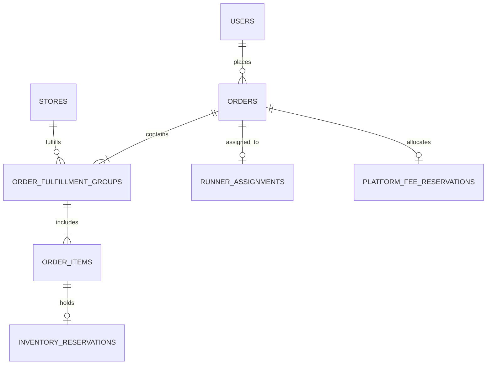
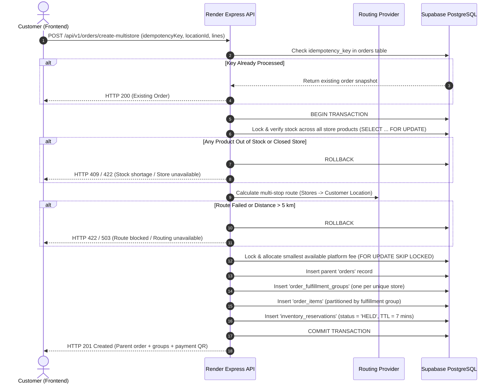

# MartIT — Backend Architecture Specification: Multi-Store Fulfillment & Combined Checkout

> **Status:** Confirmed Architecture Specification  
> **Target Stack:** Render (Node.js / Express business logic) + Supabase (PostgreSQL persistent storage)  
> **Document Version:** 1.0.0  
> **Last Updated:** 2026-10-10  
> **Related Documents:** [`docs/fee-policy.md`](file:///c:/Users/omkar/OneDrive/Desktop/MyProjects/MartIT/docs/fee-policy.md), [`docs/implementation-roadmap.md`](file:///c:/Users/omkar/OneDrive/Desktop/MyProjects/MartIT/docs/implementation-roadmap.md)

---

## 1. Executive Summary & Confirmed Decisions

MartIT supports campus-wide grocery discovery and checkout across multiple retail vendors. The customer shopping experience is **product-first**, allowing customers to add items from different campus stores into a single checkout session without upfront store selection.

### Confirmed Product Decisions
1. **Universal Product Discovery:** Customers browse and search products across all campus stores without mandatory store selection.
2. **Multi-Store Basket & Single Checkout:** A customer can purchase items originating from multiple distinct stores within a single checkout flow.
3. **Parent Order with Store Fulfillment Groups:** All items belong to a single parent order (`orders`), while items for each participating store are partitioned into distinct store fulfillment groups (`order_fulfillment_groups`).
4. **Single Runner per Parent Order:** Exactly one campus runner is assigned to the parent order. The runner sequentially visits each participating store to pick up the respective fulfillment groups before executing combined customer delivery.
5. **Single Payable Total & Payment Transaction:** There is one customer checkout, one combined payable total, and one customer payment transaction.
6. **One Combined Delivery Fee on Multi-Stop Route:** A single delivery fee is charged based on the complete multi-stop route (originating from pickup stops to customer dropoff).
7. **Single Dynamic Platform Fee:** A single dynamic platform fee (₹0.01–₹0.99) is allocated once for the parent payment attempt, not per store group.

---

## 2. System Architecture & Component Boundaries

```
 ┌───────────────────────────────────────────────────────────────┐
 │                   Frontend (Vercel / React 19)                │
 │  - Product-First Catalogue Browsing                           │
 │  - Multi-Store Cart & Combined Checkout View                  │
 │  - Single UPI Payment QR Display & Countdown Timer            │
 └───────────────────────────────┬───────────────────────────────┘
                                 │ HTTPS (JSON API)
                                 ▼
 ┌───────────────────────────────────────────────────────────────┐
 │            Authoritative Backend (Render / Node.js Express)   │
 │                                                               │
 │  ┌─────────────────────────────────────────────────────────┐  │
 │  │ API Endpoints & Idempotency Layer                       │  │
 │  ├─────────────────────────────────────────────────────────┤  │
 │  │ Multi-Stop Route Optimization & Auditable Fee Engine    │  │
 │  ├─────────────────────────────────────────────────────────┤  │
 │  │ Platform Fee Allocator (1–99 Paise Atomic Leases)       │  │
 │  ├─────────────────────────────────────────────────────────┤  │
 │  │ Runner Multi-Group Pickup & Handover State Machine      │  │
 │  ├─────────────────────────────────────────────────────────┤  │
 │  │ Make.com Payment Verification Adapter & Webhook Handler │  │
 │  └─────────────────────────────────────────────────────────┘  │
 └───────────────┬───────────────────────────────┬───────────────┘
                 │ PostgreSQL (pg pool)          │ HTTPS
                 ▼                               ▼
 ┌───────────────────────────────┐ ┌─────────────────────────────┐
 │  Supabase PostgreSQL Database │ │ Real Routing Engine Provider│
 │  - ACID Transaction Functions │ │ (e.g. Mapbox / ORS walking) │
 │  - Row Locks (FOR UPDATE)     │ └─────────────────────────────┘
 │  - Relational Schema & Checks │
 └───────────────────────────────┘
```

### Component Responsibilities

1. **Frontend (`martit-web` on Vercel):**
   - Untrusted client. Never computes authoritative totals, distances, or fees.
   - Collects multi-store cart items `[{ productId, quantity }]` and `deliveryLocationId`.
   - Displays combined checkout summary, single payment QR, and multi-store pickup progress indicators.

2. **Authoritative API Server (`martit-api` on Render Node.js/Express):**
   - Executes authoritative validation, route calculation, inventory reservation, and payment state machines.
   - Manages database transactions with strict ACID guarantees.
   - Never fabricates delivery fees or distances when routing services are unreachable.
   - Enforces rate-limited OTP verification for customer handover.

3. **Persistent Data Tier (Supabase PostgreSQL):**
   - Persistent store for all orders, fulfillment groups, inventory, and payment ledger entries.
   - Uses row-level locking (`FOR UPDATE`, `FOR UPDATE SKIP LOCKED`) to ensure race-free inventory holds and dynamic fee slot allocations.

4. **External Routing Provider (e.g., Mapbox Directions / OpenRouteService):**
   - Computes physical campus walking or road routes visiting all pickup stores and the customer delivery destination.
   - Mode and provider are strictly configured; straight-line distance is prohibited in production routing.

5. **Reconciliation Webhook (Make.com):**
   - Authoritative incoming channel for bank/UPI payment verification.
   - Only exact match `"Payment received"` transitions parent payment status to `PAID`.

---

## 3. Persistent Data Model (Supabase PostgreSQL DDL)

The data model cleanly separates the parent financial entity from store-specific logistics entities.



### 3.1 DDL Schema Definition

```sql
-- PostgreSQL Extension Prerequisites
CREATE EXTENSION IF NOT EXISTS "uuid-ossp";
CREATE EXTENSION IF NOT EXISTS "citext";

-- Enums for Order, Payment, and Fulfillment State Machines
CREATE TYPE order_status_enum AS ENUM (
  'AWAITING_PAYMENT',
  'CONFIRMED',
  'PREPARING',
  'PICKING_UP',
  'OUT_FOR_DELIVERY',
  'DELIVERED',
  'CANCELLED'
);

CREATE TYPE payment_status_enum AS ENUM (
  'PENDING',
  'PROCESSING',
  'PAID',
  'EXPIRED',
  'FAILED',
  'REFUNDED'
);

CREATE TYPE fulfillment_group_status_enum AS ENUM (
  'PENDING',
  'READY_FOR_PICKUP',
  'PICKED_UP',
  'FAILED_PICKUP',
  'CANCELLED'
);

CREATE TYPE reservation_status_enum AS ENUM (
  'HELD',
  'COMMITTED',
  'RELEASED'
);

-- ============================================================================
-- 1. PARENT ORDERS TABLE
-- Represents the customer transaction, payable total, routing, and lifecycle.
-- ============================================================================
CREATE TABLE orders (
  id VARCHAR(64) PRIMARY KEY,
  customer_id UUID NOT NULL REFERENCES auth.users(id),
  delivery_location_id VARCHAR(64) NOT NULL,
  delivery_location_snapshot JSONB NOT NULL,
  
  -- Overall Status
  status order_status_enum NOT NULL DEFAULT 'AWAITING_PAYMENT',
  payment_status payment_status_enum NOT NULL DEFAULT 'PENDING',
  
  -- Financial Snapshot (Authoritative Sums in Rupees with 2 decimal places)
  item_subtotal NUMERIC(10, 2) NOT NULL CHECK (item_subtotal >= 0),
  combined_delivery_fee NUMERIC(10, 2) NOT NULL CHECK (combined_delivery_fee >= 0),
  base_amount NUMERIC(10, 2) NOT NULL CHECK (base_amount >= 0),
  platform_fee NUMERIC(10, 2) NOT NULL CHECK (platform_fee >= 0.01 AND platform_fee <= 0.99),
  total_payable NUMERIC(10, 2) NOT NULL CHECK (total_payable >= 0),
  
  -- Multi-Stop Routing & Audit Snapshot
  route_distance_km NUMERIC(8, 4) NOT NULL CHECK (route_distance_km > 0 AND route_distance_km <= 5.0),
  route_stop_sequence JSONB NOT NULL, -- Array of stop objects: [{ type: 'PICKUP', storeId, coords, orderIndex }, { type: 'DELIVERY', locationId, coords }]
  routing_provider VARCHAR(64) NOT NULL,
  routing_mode VARCHAR(32) NOT NULL,
  routing_metadata JSONB DEFAULT '{}'::jsonb,
  fee_policy_version VARCHAR(32) NOT NULL,
  
  -- Payment Snapshot
  payment_attempt_id VARCHAR(64) NOT NULL,
  fee_paise INTEGER NOT NULL CHECK (fee_paise >= 1 AND fee_paise <= 99),
  payment_allocated_at TIMESTAMPTZ NOT NULL,
  payment_window_expires_at TIMESTAMPTZ NOT NULL,
  payment_cooldown_expires_at TIMESTAMPTZ NOT NULL,
  paid_at TIMESTAMPTZ,
  
  -- Single Runner & Handover
  runner_id UUID REFERENCES auth.users(id),
  handover_otp_hash VARCHAR(128),
  handover_attempts_count INTEGER NOT NULL DEFAULT 0,
  handover_verified_at TIMESTAMPTZ,
  
  -- Idempotency & Auditing
  idempotency_key VARCHAR(128) UNIQUE NOT NULL,
  created_at TIMESTAMPTZ NOT NULL DEFAULT NOW(),
  updated_at TIMESTAMPTZ NOT NULL DEFAULT NOW()
);

CREATE INDEX idx_orders_customer ON orders(customer_id);
CREATE INDEX idx_orders_status ON orders(status);
CREATE INDEX idx_orders_payment_status ON orders(payment_status);
CREATE INDEX idx_orders_runner ON orders(runner_id);

-- ============================================================================
-- 2. STORE FULFILLMENT GROUPS TABLE
-- Partitions order fulfillment by participating physical store.
-- ============================================================================
CREATE TABLE order_fulfillment_groups (
  id VARCHAR(64) PRIMARY KEY,
  order_id VARCHAR(64) NOT NULL REFERENCES orders(id) ON DELETE CASCADE,
  store_id VARCHAR(64) NOT NULL,
  store_snapshot JSONB NOT NULL, -- Name, address, coordinates, contact
  pickup_sequence_index INTEGER NOT NULL CHECK (pickup_sequence_index >= 0),
  
  -- Group Status
  status fulfillment_group_status_enum NOT NULL DEFAULT 'PENDING',
  
  -- Progress Timestamps
  ready_for_pickup_at TIMESTAMPTZ,
  picked_up_at TIMESTAMPTZ,
  failed_at TIMESTAMPTZ,
  failure_reason TEXT,
  
  created_at TIMESTAMPTZ NOT NULL DEFAULT NOW(),
  updated_at TIMESTAMPTZ NOT NULL DEFAULT NOW(),
  
  CONSTRAINT uq_order_store UNIQUE (order_id, store_id)
);

CREATE INDEX idx_fulfillment_groups_order ON order_fulfillment_groups(order_id);
CREATE INDEX idx_fulfillment_groups_store_status ON order_fulfillment_groups(store_id, status);

-- ============================================================================
-- 3. ORDER ITEMS TABLE (LINE ITEMS PER FULFILLMENT GROUP)
-- ============================================================================
CREATE TABLE order_items (
  id VARCHAR(64) PRIMARY KEY,
  order_id VARCHAR(64) NOT NULL REFERENCES orders(id) ON DELETE CASCADE,
  fulfillment_group_id VARCHAR(64) NOT NULL REFERENCES order_fulfillment_groups(id) ON DELETE CASCADE,
  store_id VARCHAR(64) NOT NULL,
  product_id VARCHAR(64) NOT NULL,
  
  -- Item Snapshot at time of order creation
  product_name VARCHAR(255) NOT NULL,
  product_pack VARCHAR(100),
  unit_price NUMERIC(10, 2) NOT NULL CHECK (unit_price >= 0),
  quantity INTEGER NOT NULL CHECK (quantity >= 1),
  line_subtotal NUMERIC(10, 2) NOT NULL CHECK (line_subtotal >= 0),
  
  created_at TIMESTAMPTZ NOT NULL DEFAULT NOW()
);

CREATE INDEX idx_order_items_group ON order_items(fulfillment_group_id);
CREATE INDEX idx_order_items_product ON order_items(product_id);

-- ============================================================================
-- 4. INVENTORY RESERVATIONS TABLE
-- Tracks stock holds across participating stores during checkout & payment.
-- ============================================================================
CREATE TABLE inventory_reservations (
  id VARCHAR(64) PRIMARY KEY,
  order_id VARCHAR(64) NOT NULL REFERENCES orders(id) ON DELETE CASCADE,
  store_id VARCHAR(64) NOT NULL,
  product_id VARCHAR(64) NOT NULL,
  quantity INTEGER NOT NULL CHECK (quantity >= 1),
  status reservation_status_enum NOT NULL DEFAULT 'HELD',
  expires_at TIMESTAMPTZ NOT NULL,
  committed_at TIMESTAMPTZ,
  released_at TIMESTAMPTZ,
  created_at TIMESTAMPTZ NOT NULL DEFAULT NOW()
);

CREATE INDEX idx_inventory_reservations_order ON inventory_reservations(order_id);
CREATE INDEX idx_inventory_reservations_active ON inventory_reservations(store_id, product_id, status)
  WHERE status = 'HELD';

-- ============================================================================
-- 5. PLATFORM FEE RESERVATIONS TABLE
-- 99 slots (1–99 paise) for dynamic platform fee allocation per payment.
-- ============================================================================
CREATE TABLE platform_fee_reservations (
  fee_paise INTEGER PRIMARY KEY CHECK (fee_paise >= 1 AND fee_paise <= 99),
  active_order_id VARCHAR(64) REFERENCES orders(id) ON DELETE SET NULL,
  attempt_id VARCHAR(64),
  allocated_at TIMESTAMPTZ,
  window_expires_at TIMESTAMPTZ,
  cooldown_expires_at TIMESTAMPTZ,
  is_paid BOOLEAN NOT NULL DEFAULT FALSE,
  paid_at TIMESTAMPTZ
);
```

---

## 4. Multi-Stop Routing & Combined Delivery Fee Engine

### 4.1 Route Determination Protocol
A multi-store order requires a single physical runner to visit all participating store locations before delivering to the customer dropoff spot.

1. **Stops Input Construction:**
   - Let $\mathcal{S} = \{S_1, S_2, \dots, S_n\}$ be the set of unique physical pickup locations for the $n$ participating stores ($n \ge 1$).
   - Let $D_{cust}$ be the coordinates of the customer delivery location.
2. **Stop Ordering Heuristic (Campus Routing):**
   - For small campus networks ($n \le 4$), evaluate the permutation of pickup stops $(S_{\pi(1)}, \dots, S_{\pi(n)})$ minimizing total route distance:
     $$\min_{\pi} \left[ \text{Distance}(S_{\pi(1)} \to S_{\pi(2)} \to \dots \to S_{\pi(n)} \to D_{cust}) \right]$$
   - Store sequence is snapshotted in `orders.route_stop_sequence` with ordered indices $0 \dots n$.
3. **Route Distance Calculation:**
   - Must invoke the explicitly configured routing service (`process.env.ROUTING_PROVIDER`, e.g., Mapbox Directions API, OpenRouteService) using walking or road profile (`process.env.ROUTING_MODE=walking`).
   - The route distance $d_{combined}$ is the real calculated route distance in kilometres.
4. **Audit Snapshot Invariant:**
   - The order persists:
     - `route_distance_km`: Real distance returned by routing engine.
     - `route_stop_sequence`: Explicit JSON array of ordered pickup and dropoff waypoints.
     - `routing_provider`: Identifier of routing service (e.g., `mapbox_directions_v5`).
     - `routing_mode`: Mode parameter used (e.g., `walking`).
     - `fee_policy_version`: Policy version (e.g., `2026-10-09.1`).

### 4.2 Combined Delivery Fee Tiers
The existing single delivery fee schedule ([`docs/fee-policy.md`](file:///c:/Users/omkar/OneDrive/Desktop/MyProjects/MartIT/docs/fee-policy.md)) applies strictly to the combined route distance $d_{combined}$:

| Combined Distance $d_{combined}$ | Delivery Fee | Action / Rule |
|---|---|---|
| $0 < d_{combined} \le 0.5\text{ km}$ | ₹10 | Short multi-stop campus delivery |
| $0.5 < d_{combined} \le 1.0\text{ km}$ | ₹15 | Nearby multi-stop delivery |
| $1.0 < d_{combined} \le 2.0\text{ km}$ | ₹20 | Medium multi-stop delivery |
| $2.0 < d_{combined} \le 5.0\text{ km}$ | $20 + 5 \times \lceil d_{combined} - 2 \rceil$ | ₹5 per started km beyond 2 km (up to ₹35 for 5 km) |
| $d_{combined} > 5.0\text{ km}$ | Blocked | HTTP 422 `ROUTE_EXCEEDS_MAX_SERVICE_DISTANCE` |

### 4.3 Fail-Closed Routing Rule
If the configured route provider is unreachable, returns an error, or the multi-stop route cannot be computed with high confidence:
- **Strict Prohibition:** Do NOT fabricate a distance, guess straight-line sums, or provide an arbitrary fee estimate.
- **Fail-Closed Response:** Reject the quote/checkout request with HTTP 503 `ROUTING_SERVICE_UNAVAILABLE` and user-friendly error: *"Unable to calculate delivery route across campus stores right now. Please try again shortly."*

---

## 5. Combined Payment & Dynamic Platform Fee Allocation

### 5.1 Authoritative Payable Total Formulation
The payable total is computed entirely on the server using integer-paise math:
1. **Item Subtotal:** $\text{subtotal} = \sum_{i} (\text{unit\_price}_i \times \text{quantity}_i)$
2. **Base Amount:** $\text{baseAmount} = \text{round}(\text{subtotal} + \text{combinedDeliveryFee})$
3. **Dynamic Platform Fee:** $\text{feeRupees} = \frac{\text{feePaise}}{100}$ where $\text{feePaise} \in [1, 99]$
4. **Total Payable:** $\text{total} = \frac{\text{round}(\text{baseAmount} \times 100) + \text{feePaise}}{100}$

### 5.2 Dynamic Platform Fee Allocation & Concurrency Guard
- Exactly **one** platform fee slot is leased per parent order payment attempt.
- Selection policy: **Smallest available eligible paise** ($1 \le p \le 99$) whose current status is `AVAILABLE` (where $\text{now} \ge \text{cooldown\_expires\_at}$).
- **Concurrency Locking in PostgreSQL:**
  ```sql
  -- Atomic fee slot allocation within transaction
  SELECT fee_paise
  FROM platform_fee_reservations
  WHERE (active_order_id IS NULL OR NOW() >= cooldown_expires_at)
    AND is_paid = FALSE
  ORDER BY fee_paise ASC
  LIMIT 1
  FOR UPDATE SKIP LOCKED;
  ```
- **Hold Durations:**
  - Verification window: 2 minutes (120,000 ms).
  - Cooldown: 5 minutes (300,000 ms) starting immediately when the 2-minute window expires.
  - Total hold time: 7 minutes (420,000 ms) before an unverified slot is recycled.

### 5.3 Single Customer Payment Transaction
- One UPI QR code is rendered encoding the parent order's `total_payable`.
- Group-level fulfillment statuses remain independent from the payment status.
- Payment transitions from `PENDING` $\to$ `PAID` **only** upon receipt of trusted server-side verification evidence (`"Payment received"` from the Make.com webhook adapter).

---

## 6. Server-Side Transactional Order Creation (Render Node.js/Express)



### 6.1 Transaction Invariants
1. **Atomicity:** All store groups, item lines, inventory holds, and the platform fee slot are reserved inside a single database transaction. If any validation fails, the entire transaction is rolled back.
2. **Idempotency:** The client sends an `idempotencyKey` UUID. If network retries resend the same payload, the backend returns the already created order without re-allocating fees or re-holding inventory.
3. **No Partial Stock Holds:** Partial availability across stores is rejected outright. Either all requested items in all stores are locked, or none are.

---

## 7. Single Runner Multi-Store Fulfillment & Handover Lifecycle

### 7.1 Lifecycle State Transitions

```
[Parent Order: CONFIRMED]
           │
           ▼ Runner Accepts Parent Order
[Parent Order: PREPARING / PICKING_UP]
           │
     ┌─────┴─────────────────────────┐
     │ Store Group 1: PENDING        │
     │ Store Group 2: PENDING        │
     └───────────────────────────────┘
           │ Runner arrives at Store 1 & confirms pickup
           ▼
     ┌───────────────────────────────┐
     │ Store Group 1: PICKED_UP  ✓   │
     │ Store Group 2: PENDING        │
     └───────────────────────────────┘
           │ Runner arrives at Store 2 & confirms pickup
           ▼
     ┌───────────────────────────────┐
     │ Store Group 1: PICKED_UP  ✓   │
     │ Store Group 2: PICKED_UP  ✓   │
     └───────────────────────────────┘
           │ All groups PICKED_UP verified by server
           ▼
[Parent Order: OUT_FOR_DELIVERY]
           │ Runner reaches customer; customer provides OTP
           ▼
[Parent Order: DELIVERED] (Order Completed)
```

### 7.2 Fulfillment Enforcement Invariants
1. **Single Runner Assignment:** The parent order is claimed atomically by exactly one runner (`orders.runner_id`).
2. **Group Pickup Enforcement:** The runner calls `POST /api/v1/runner/orders/:id/pickup-group` with `{ fulfillmentGroupId }`. The server validates that the runner is assigned to the parent order and updates the group status to `PICKED_UP`.
3. **Delivery Gatekeeper:** The parent order **CANNOT** transition to `OUT_FOR_DELIVERY` until:
   $$\forall g \in \text{fulfillment\_groups}, \quad g.\text{status} = \text{'PICKED\_UP'}$$
   Any attempt by the runner or client to complete customer delivery before all stores have supplied their items is rejected with HTTP 409 `UNPICKED_STORE_GROUPS_REMAINING`.
4. **Server-Authoritative OTP Verification:**
   - A 4-digit numeric handover OTP is generated at payment confirmation and hashed (`bcrypt` / `argon2` / `hmac-sha256`) in `orders.handover_otp_hash`.
   - Customer shows OTP to runner at the door. Runner submits `POST /api/v1/runner/orders/:id/verify-handover` with `{ otp }`.
   - **Rate Limiting:** Max 3 failed attempts per order; subsequent attempts are locked for 5 minutes.
   - Successful verification atomically marks `orders.status = 'DELIVERED'` and sets `handover_verified_at = NOW()`.

---

## 8. Failure Handling Matrix & Edge Cases

| Failure Scenario | Detection Stage | Authoritative System Action | Customer Experience | Runner / Store Action | Test Validation |
|---|---|---|---|---|---|
| **Store Closes During Checkout** | Pre-transaction check during `create-multistore` | Abort transaction. Release any in-flight locks. No order created. | Error banner: *"Store [Name] just closed. Please update your cart."* | Store receives no order. Cart retains items for customer decision. | Test: Store `isOpen = false` during order creation fails atomically. |
| **Partial Stock Shortage Across Stores** | Inventory row-locking (`SELECT FOR UPDATE`) | Transaction rolled back immediately. Zero stock reserved in any store. | Error modal: *"Only [N] of [Product] available at [Store]." Cart updated.* | Other stores keep their stock. No partial order created. | Test: Multi-store cart where Store B has insufficient stock cancels Store A holds. |
| **Route Calc Failure / Route > 5 km** | Route calculation in checkout | Transaction rolled back. Order creation rejected. | Clear explanation: *"Combined delivery route exceeds 5 km campus boundary (computed: 5.4 km)."* | No runner dispatched. No fee charged. | Test: Multi-store route $> 5$ km blocked; downstream APIs not invoked. |
| **Runner Drops Out Mid-Pickup** | Runner app signals drop or heartbeat timeout (15 min) | Unassign `orders.runner_id = NULL`. Retain existing `PICKED_UP` statuses on completed groups. Re-queue order for runners. | Status reflects *"Assigning replacement campus runner..."* | New runner sees which stores are already collected and only visits pending stores. | Test: Runner dropout retains already-picked-up groups and prevents duplicate visits. |
| **Store Pickup Fails (Store out of stock on arrival)** | Runner reports pickup failure via app | Group marked `FAILED_PICKUP`. Admin support notified. Parent order enters compensation workflow. | Notification: *"Store [Name] cannot fulfill its items. Refund initiated for those items."* | Runner instructed to proceed with remaining verified store groups or hold. | Test: Store pickup failure triggers partial refund while preserving completed pickups. |
| **Payment Succeeded, Fulfillment Fails** | Post-payment exception or all stores unreachable | Parent payment marked for refund. Background worker processes UPI refund ledger entry. | Empathetic notification: *"Order could not be fulfilled. Full refund of ₹[Total] issued."* | Cancelled fulfillment groups notified. Platform fee slot released. | Test: Post-payment cancellation issues single parent refund for exact paid amount. |
| **Duplicate Checkout Requests (Network Retry)** | Idempotency key lookup at controller entry | Immediate lookup returns existing order representation without re-running transactions. | Seamless checkout screen without double charges. | Exact same single order ID and single payment QR presented. | Test: Concurrent duplicate `create-multistore` requests result in exactly 1 DB record. |
| **Expired Verification Window (2 mins)** | Server-authoritative timer in `orders.get` or `checkPayment` | Payment status transitions to `EXPIRED`. Platform fee enters 5-minute cooldown. | Screen indicates window expired, prompts user to re-checkout or contact admin. | No runner dispatched. Inventory holds released after cooldown. | Test: Expired payment window prevents late runner assignment. |

---

## 9. Rollout Strategy, Phased Migration & Safety Boundaries

### 9.1 Coexistence with Single-Store Checkout
To prevent disruption to ongoing testing and development:
- **Baseline Continuity:** The existing single-store checkout flow (`useCartStore`, `orders.create`, in-browser mock server) remains fully operational and functional.
- **Backend Schema Migration First:** Supabase PostgreSQL migrations will deploy tables with backwards-compatible relationships. Single-store orders simply populate exactly one row in `order_fulfillment_groups`.
- **Feature Flag Gating:**
  ```javascript
  // Server-side environment flag
  const FEATURE_MULTI_STORE_CHECKOUT = process.env.FEATURE_MULTI_STORE_CHECKOUT === 'true'
  ```
  Multi-store checkout will remain disabled in production until all integration tests against live Supabase PostgreSQL pass.

### 9.2 Status Tracking Matrix

| Capability / Milestone | Implemented in Repo | Tested Against Real Database | Enabled in Production |
|---|:---:|:---:|:---:|
| **Product-First Browsing (All Stores)** | **YES** | N/A (Client/Mock) | **YES** |
| **Multi-Store PostgreSQL Schema & DDL** | **YES** (Documented) | **NO** (Pending Supabase provision) | **NO** |
| **Multi-Stop Route Engine (Mapbox/ORS)** | **NO** (Design specified) | **NO** | **NO** |
| **Atomic Multi-Store Order Transaction API** | **NO** (Design specified) | **NO** | **NO** |
| **Single Runner Group Pickup State Machine** | **NO** (Design specified) | **NO** | **NO** |
| **Rate-Limited Delivery Handover OTP** | **NO** (Design specified) | **NO** | **NO** |
| **Full Multi-Store Combined Checkout** | **NO** | **NO** | **NO** |

---

## 10. Audit Verification Checklist for Engineers

Before enabling `FEATURE_MULTI_STORE_CHECKOUT` in production:
- [ ] Supabase migrations applied and foreign key cascading verified.
- [ ] Idempotency key unique constraint validated under load testing.
- [ ] Concurrent platform fee allocation tested with 100 simultaneous simulated checkout requests.
- [ ] Route calculation failure simulates fail-closed behavior with zero fee fabrication.
- [ ] Runner app restricts `OUT_FOR_DELIVERY` until all group rows are `PICKED_UP`.
- [ ] Make.com webhook adapter verified against sandbox bank payload.
